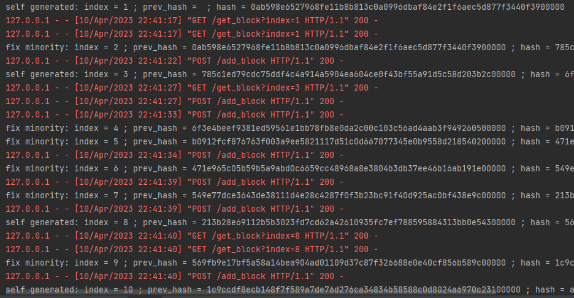
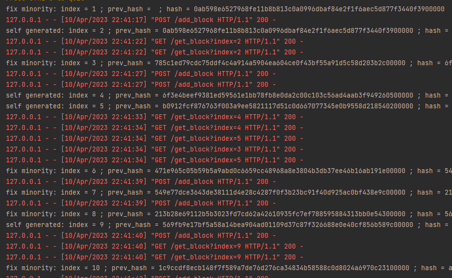
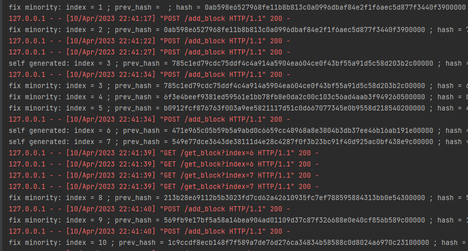

# BlockChainEmo-ul-
[](https://github.com/artempol-android/BlockChainEmo-ul/actions/workflows/main.yml)

Simplified blockchain for the course assignment theory of computer networks
 ## Run docker
```
docker build -t emo-chain . 
docker-compose up 
```
## Working

Master node - node0:


node1:


node2:
